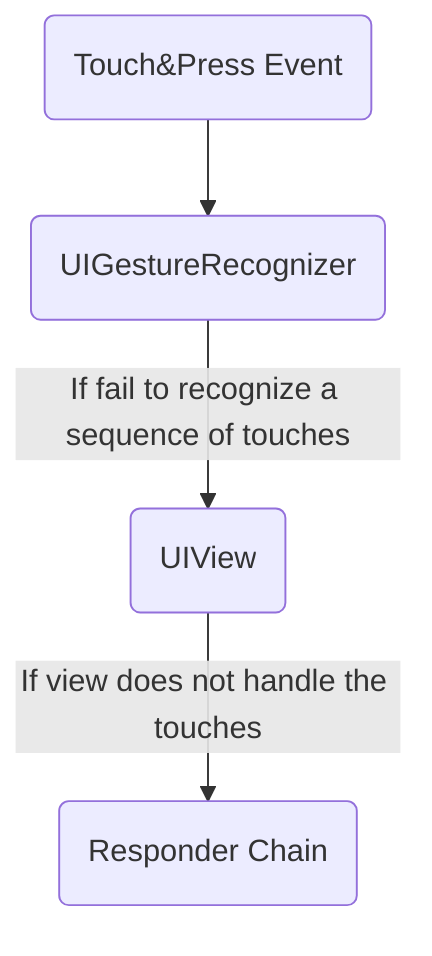

# [Touches, Presses, and Gestures](https://developer.apple.com/documentation/uikit/touches_presses_and_gestures)
 
앱의 gesture recognizer에 대한 event-handling logic을 캡슐화함으로써,  앱 전반적으로 해당 코드를 재사용할 수 있습니다.
만약, cutom view를 사용한다면,  view에서 발생하는 touch event들에 대해서 모두 처리를 해야합니다.

Touch event를 처리하는 방법은 2가지가 존재합니다.
- Gesture Recognizer를 이용하여 track ( 참고 : [Handling UIKit Gestures](https://developer.apple.com/documentation/uikit/touches_presses_and_gestures/handling_uikit_gestures) )
- `UIView` subclass에서 직접적으로 track ( 참고 : [Handling Touches in Your View](https://developer.apple.com/documentation/uikit/touches_presses_and_gestures/handling_touches_in_your_view) )

---

# [Using Responders and the Responder Chain to Handle Events](https://developer.apple.com/documentation/uikit/touches_presses_and_gestures/using_responders_and_the_responder_chain_to_handle_events)

App에서 *Responder Object*를 이용하여 event를 받고, 처리합니다. 
Responder Object는 `UIResponder` 클래스의 모든 인스턴스이며 공통 하위 클래스에는 `UIView`, `UIViewController` 및 `UIApplication`이 포함됩니다. 

Responder는 raw event data를 받고 event를 처리하거나 다른 responder object로 전달합니다. App이 event를 받았을 때, UIKit은 자동적으로 해당 event를 가장 적합한 responder object( *the first responder* )로 보내줍니다.

처리되지않은 event들은 the active **responder chain** 을 통하여 responder에서 responder로 보내지며, 이것은 responder object의 the dynamic configuration입니다.

아래의 그림은 label, textField, button, 2개의 background View가 포함된 interface가 있는 app의 responder를 보여주고 있습니다. 이 다이어그램은 the responder chain을 따라 어떻게 event들이 responder에서 다음 responder로 이동하는지 보여줍니다.

1. 만약 textField가 event를 처리하지 않는다면, `UIKit`은 textField의 parent `UIView`로 event를 보낸 후, window의 root view로 보냅니다. 
2. Event를 window로 바로 보내기 전에, root view에서는 responder chain이 event를 ViewController로 우회시킵니다.
3. 만약 Window가 event를 처리하지 못한다면, `UIKit`은 `UIApplication` object로 event를 전달합니다. 그리고, 해당 object가 `UIResponder`의 instance이고 아직 responder chain의 일부가 아니라면,  `UIApplicationDelegate`에 전달합니다.

### Determining an Event's First Responder

UIKit은 event의 유형에 따라 object를 *the first responder*로 임명합니다.

| Event Type | First Responder				|
| --										| --										|
| Touch events					| Touch가 발생한 View 		|
| Press events						| 초점이 맞추어진 Object 	|
| Shake-motion events 		| The object that you (or UIKit) designate. |
| Remote-control events 	| The object that you (or UIKit) designate. |
| Editing menu messages	| The object that you (or UIKit) designate. |

Accelerometers, gyroscopes, magnetometer과 연관된 Motion event들은 responder chain을 따르지 않습니다. 대신, Core Motion은 이 event들을 임명된 object들로 직접적으로 전달합니다. ( 참고 :  [Core Motion Framework](https://developer.apple.com/library/archive/documentation/Miscellaneous/Conceptual/iPhoneOSTechOverview/CoreServicesLayer/CoreServicesLayer.html#//apple_ref/doc/uid/TP40007898-CH10-SW27) )
 
Control들은 연관된 target object와 action message를 이용하여 직접접 통신합니다. 사용자가 Control과 상호작용할 때, Control은 target object에 action message를 보냅니다.
Action Message는 event가 아니지만, responder chain을 활용할 수 있습니다.
Control의 target object가 `nil`일 경우, UIKit은 target object에서 시작하여 적절한 action method를 구현하는 object를 찾을때 까지 responder chain을 가로지릅니다. 예를 들어, UIKit editing menu는 이 동작을 사용하여 `cut(_:)`, `copy(_:)`, `past(_:)`와 같은 method를 구현하는 responder object를 찾습니다.

Gesture recognizers는 touch와 press event를 view가 받기 전에 받습니다. 만약 view의 gesture recognizer가 sequence of touches를 인지하는 것에 실패한다면, UIKit은 view에게 touches를 전달합니다. 만약 view마저도 touches를 처리하지 못한다면, UIKit은 touches를 responder chain에 전달합니다.  ( 참고 : [Handling UIKit Gestures](https://developer.apple.com/documentation/uikit/touches_presses_and_gestures/handling_uikit_gestures) )

### Determining Which Responder Contained a Touch Event

UIKit은 touch event가 어디서 발생했는 지를 결정하기 위하여 view-based hit-testing을 이용합니다. UIKit은 view hierarchy 내의 view objects의 범위에서 touch location을 비교합니다.  `UIView` 의 method인 [`hitTest(_:with:)`](https://developer.apple.com/documentation/uikit/uiview/1622469-hittest)는 지정된 touch를 포함하는 가장 깊은 subview( touch event의 first responder )를 찾기 위하여 view hierarchy를 순회합니다.  
> 만약 touch location이 view 범위를 벗어나면, `hitTest(_:with:)` 는 view와 모든 subview를 무시합니다. 결과적으로 view의 `clipsToBounds`가 `false`일 때,  해당 view의 범위를 벗어난 subview 영역은  반환되지 않습니다.

# Reference

- Apple Documentation
	- [Touches, Presses, and Gestures](https://developer.apple.com/documentation/uikit/touches_presses_and_gestures)
		- [Using Responders and the Responder Chain to Handle Events](https://developer.apple.com/documentation/uikit/touches_presses_and_gestures/using_responders_and_the_responder_chain_to_handle_events)
		- Use gesture recognizers to track the touches, [Handling UIKit Gestures](https://developer.apple.com/documentation/uikit/touches_presses_and_gestures/handling_uikit_gestures).
		-  Track the touches directly in your [Handling Touches in Your View](https://developer.apple.com/documentation/uikit/touches_presses_and_gestures/handling_touches_in_your_view).
	- [Advanced Touch Input on iOS (2015)](https://developer.apple.com/videos/play/wwdc2015/233/)
	- [Leveraging Touch Input on iOS (2016)](https://developer.apple.com/videos/play/wwdc2016/220)

