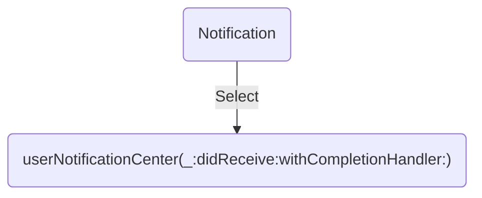

Silent Notification은 Background에 있는 app을 깨울 수 있습니다. 이를 이용하여, Foreground가 아닌 상태에서도 app 내부의 로직을 수행시킬 수 있습니다. 
Silent Notification으로 만들기 위해서는 `"content_available" : 1`  를 담아주어야합니다.
Silent Notification을 받게 되면, App을 Background에서 깨우고, [`application(_:didReceiveRemoteNotification:fetchCompletionHandler:)`](https://developer.apple.com/documentation/uikit/uiapplicationdelegate/1623013-application)를 호출합니다.
(참고 : [Pushing Updates to Your App Silently](https://developer.apple.com/documentation/usernotifications/setting_up_a_remote_notification_server/pushing_updates_to_your_app_silently) )

``` mermaid
graph TD
provider["Firebase"]
apns["APNs"]
subgraph Foreground
willPresent("userNotificationCenter(_:willPresent:withCompletionHandler:)")
end
subgraph Background
wakeUp(Wake Up!)
didReceiveRemoteNotification("application(_:didReceiveRemoteNotification:fetchCompletionHandler:)")
end
provider-->apns
apns-->willPresent
apns--"Silent Notification"-->wakeUp
wakeUp-->didReceiveRemoteNotification
end
```

Notification을 select하면, [`userNotificationCenter(_:didReceive:withCompletionHandler:)`](https://developer.apple.com/documentation/usernotifications/unusernotificationcenterdelegate/1649501-usernotificationcenter)를 호출합니다.




## Postman을 이용할 경우
```json
https://fcm.googleapis.com/fcm/send
POST
Content-Type : application/json
Authorization : key=YOUR_CLOUD_MESSAGING_SERVER_KEY

{
	"to" : "YOUR_FIREBASE_TOKEN",
	"notification" : {
						"body" : "Notification Body",
						"title" : "Notification Title",
						"content_available" : true,
						"priority" : "high"
	},
	"data" : {
				"body" : "Data Body",
				"title" : "Data Title",
				"key" : "value"
	} 
}
```

Result
```swift 
[
	AnyHashable("gcm.message_id"): MESSAGE_ID,
	AnyHashable("aps"): {  
		alert = {  
			body = "Notification Body";
			title = "Notification Title";
		};
		"content-available" = 1;
	},
	AnyHashable("google.c.a.e"): 1,
	AnyHashable("title"): Data Title,
	AnyHashable("key"): value,
	AnyHashable("body"): Data Body,
	AnyHashable("gcm.notification.priority"): high  
]
```


# Reference

- Apple
	- [UserNotifications](https://developer.apple.com/documentation/usernotifications/)
	- [Setting Up a Remote Notification Server](https://developer.apple.com/documentation/usernotifications/setting_up_a_remote_notification_server)
	- [Pushing Updates to Your App Silently](https://developer.apple.com/documentation/usernotifications/setting_up_a_remote_notification_server/pushing_updates_to_your_app_silently#2980037)
- Firebase
	- [Messaging Example](https://github.com/firebase/quickstart-ios/blob/master/messaging/MessagingExampleSwift/AppDelegate.swift)
	- [Cloud Messaging Documentation](https://firebase.google.com/docs/cloud-messaging/ios/client)

