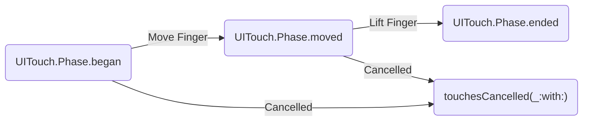

만약 view의 내용과 touch handling이 복잡하게 연결되어져 있는 경우, view subclass에서 touch event를 직접 사용하는 것이 좋습니다.

## Overview
만약 gesture recognizer를 custom View에서 사용하지 않을 계획이라면, touch event를 view 자체에서 직접 처리할 수 있습니다. view는 **responder**이기 때문에, view는 Multi-Touch event와 많은 다른 event 타입들을 처리할 수 있습니다. `UIKit`이 touch event가 view에서 발생하는 것을 판단했을 때, view의 [`touchesBegan(_:with:)`](https://developer.apple.com/documentation/uikit/uiresponder/1621142-touchesbegan), [`touchesMoved(_:with:)`](https://developer.apple.com/documentation/uikit/uiresponder/1621107-touchesmoved), 또는 [`touchesEnded(_:with:)`](https://developer.apple.com/documentation/uikit/uiresponder/1621084-touchesended)를 호출합니다. 이 method들을 custom View에서 override하고 touch event에 대한 response를 제공하는데 사용할 수 있습니다.

Touch를 처리하기 위하여 touch view(또는 responder)에서 override한 method들은 touch event-handling process의 다른 단계들에 해당합니다. 예를 들어, 그림1 은 touch event의 다른 단계들을 보여줍니다. 손가락(또는 Apple Pencil)이 스크린을 터치할 때, `UIKit`은 `UITouch` Object를 생성, touch location 을 적절한 지점으로 설정합니다. 그리고, [`phase`](https://developer.apple.com/documentation/uikit/uitouch/1618113-phase) property를 [`UITouch.Phase.began`](https://developer.apple.com/documentation/uikit/uitouch/phase/began)로 설정합니다. 동일한 손락이 스크린주위로 이동할 때, `UIKit`은 touch location을 update하고 `phase` property를 [`UITouch.Phase.moved`](https://developer.apple.com/documentation/uikit/uitouch/phase/moved)로 변경합니다. 사용자가 화면에서 손가락을 들어올리면, `UIKit`은 `phase` property를 [`UITouch.Phase.ended`](https://developer.apple.com/documentation/uikit/uitouch/phase/ended)로 변경하고 touch sequence를 종료시킵니다. 

마찬가지로, 시스템은 언제든지 진행중인 touch sequence를 취소할 수 있습니다. 예를 들어, 전화가 와서 app을 가로막을 때가 있습니다.  이러한 경우, `UIKit`은 [`touchesCancelled(_:with:)`](https://developer.apple.com/documentation/uikit/uiresponder/1621116-touchescancelled)을 호출하여 view에게 알립니다. 이 method를 이용하여 view의 data structure에 대하여 필요한 정리를 수행할 수 있습니다.

UIKit은 화면에 터치한 각각의 새로운 손가락에 대하여 새로운 `UITouch` object를 생성합니다. touch들은 스스로 현재 `UIEvent` object와 함께 전달됩니다. `UIKit`은 손가락에서 나오는 터치와 Apple Pencil에서 나오는 터치를 구분할 수 있습니다.

> 이 default configuration에서 view는 하나 이상의 손가락이 view에 닿더라도, 오직 첫번째 event와 연관된 `UITouch` object를 받습니다. 추가적인 터치를 받기 위해서는, `isMultipleTouchEnabled` property를 true로 해야합니다. 또한 이 property는 Interface Builder에서 Attribute Inspector를 이용하여 변경할 수 있습니다.

# Reference

- Apple Documentation
		-  Track the touches directly in your [Handling Touches in Your View](https://developer.apple.com/documentation/uikit/touches_presses_and_gestures/handling_touches_in_your_view). 
